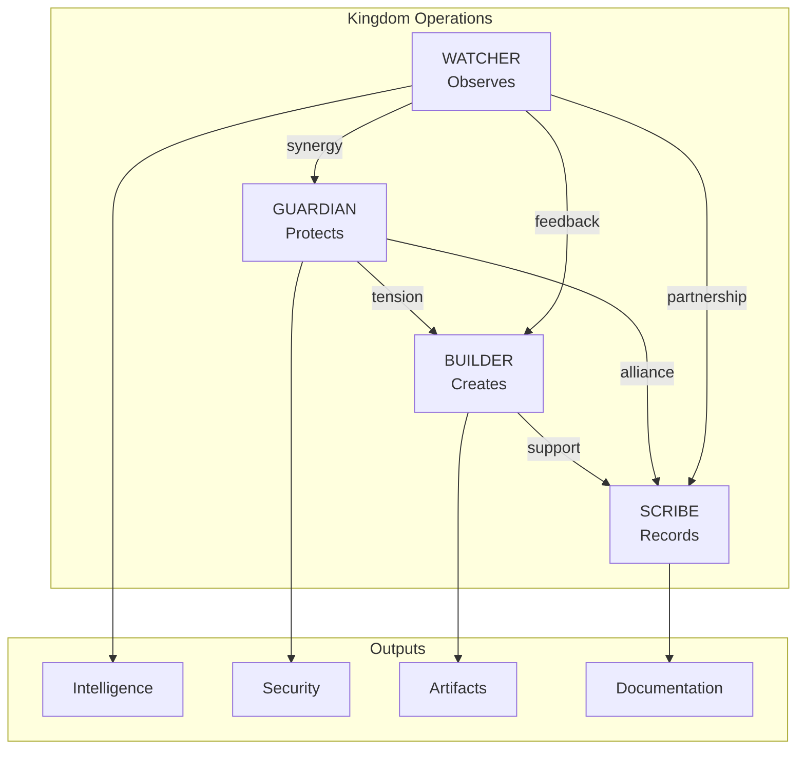
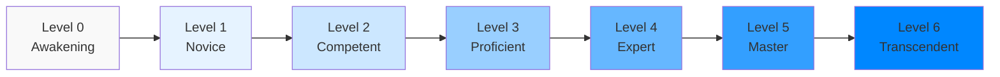
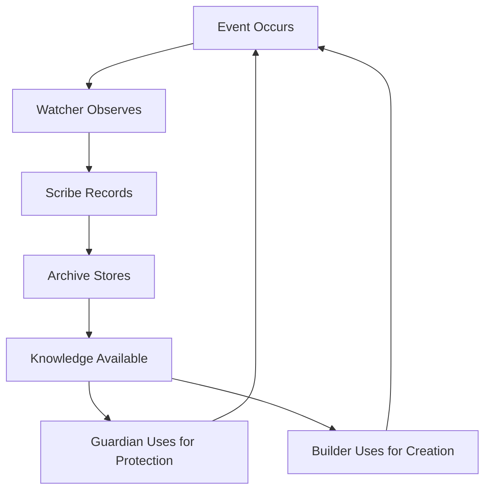

# Kingdom Structure Map

*Visual Navigation of Class Relationships, Information Flow, and Focus Level Integration*

**Protocol Status:** Canon  
**Version:** 1.0  
**Focus Level:** 3

---

```
    ╔═══════════════════════════════════════════════════════════╗
    ║                    🗺️ KINGDOM MAP 🗺️                      ║
    ║           "See the whole to understand the parts"          ║
    ╚═══════════════════════════════════════════════════════════╝
```

---

## Overview

This map provides visual representations of:
- Class relationships and interactions
- Information flow through the Kingdom
- Focus Level progression paths
- Documentation structure

---

## Part I: The Four Classes

### Class Relationship Diagram

```
                            ┌─────────────────┐
                            │    KINGDOM      │
                            │   OPERATIONS    │
                            └────────┬────────┘
                                     │
           ┌─────────────────────────┼─────────────────────────┐
           │                         │                         │
           ▼                         ▼                         ▼
    ┌──────────────┐          ┌──────────────┐          ┌──────────────┐
    │   OBSERVE    │          │   PROTECT    │          │    CREATE    │
    │              │          │              │          │              │
    │   WATCHER    │◄────────►│   GUARDIAN   │◄────────►│   BUILDER    │
    │      👁️      │  synergy │      🛡️      │  tension │      🔨      │
    └──────┬───────┘          └──────┬───────┘          └──────┬───────┘
           │                         │                         │
           │         ┌───────────────┼───────────────┐         │
           │         │               │               │         │
           │         ▼               ▼               ▼         │
           │    ┌─────────────────────────────────────────┐    │
           │    │                 RECORD                   │    │
           │    │                                          │    │
           └───►│                 SCRIBE                   │◄───┘
                │                   📜                     │
                └─────────────────────────────────────────┘
```

### Class Interaction Matrix

```
              │ GUARDIAN │ BUILDER │ SCRIBE │ WATCHER │
    ──────────┼──────────┼─────────┼────────┼─────────┤
    GUARDIAN  │    ═══   │ Tension │Alliance│ Synergy │
    ──────────┼──────────┼─────────┼────────┼─────────┤
    BUILDER   │ Tension  │   ═══   │Support │Feedback │
    ──────────┼──────────┼─────────┼────────┼─────────┤
    SCRIBE    │ Alliance │ Support │  ═══   │Partner  │
    ──────────┼──────────┼─────────┼────────┼─────────┤
    WATCHER   │ Synergy  │Feedback │Partner │  ═══    │
    ──────────┴──────────┴─────────┴────────┴─────────┘
```

### Relationship Types

| Type | Symbol | Description |
|------|--------|-------------|
| **Synergy** | ◄──►+ | Mutual enhancement |
| **Alliance** | ◄──►○ | Natural partnership |
| **Support** | ◄──►~ | Complementary roles |
| **Feedback** | ◄──►↺ | Information exchange |
| **Tension** | ◄──►! | Productive friction |

---

## Part II: Information Flow

### Primary Information Channels

```
    ┌─────────────────────────────────────────────────────────────┐
    │                     INFORMATION FLOW                         │
    └─────────────────────────────────────────────────────────────┘

                         OBSERVATIONS
                              │
                              ▼
    ┌──────────┐        ┌──────────┐        ┌──────────┐
    │ WATCHER  │───────►│  SCRIBE  │───────►│ ARCHIVES │
    │ observes │ reports│ records  │ stores │ preserve │
    └──────────┘        └──────────┘        └──────────┘
         │                   │                   │
         │                   │                   │
         ▼                   ▼                   ▼
    ┌──────────┐        ┌──────────┐        ┌──────────┐
    │ GUARDIAN │◄───────│KNOWLEDGE │◄───────│ BUILDER  │
    │ protects │ informs│   BASE   │ creates│ builds   │
    └──────────┘        └──────────┘        └──────────┘
```

### Feedback Loops

```
    ┌─────────────────────────────────────────────────────────────┐
    │                      FEEDBACK LOOPS                          │
    └─────────────────────────────────────────────────────────────┘

    CREATION LOOP:
    ┌──────────┐     ┌──────────┐     ┌──────────┐     ┌──────────┐
    │ BUILDER  │────►│ ARTIFACT │────►│ WATCHER  │────►│ FEEDBACK │
    │ creates  │     │ deployed │     │ monitors │     │ provided │
    └──────────┘     └──────────┘     └──────────┘     └────┬─────┘
         ▲                                                   │
         └───────────────────────────────────────────────────┘

    PROTECTION LOOP:
    ┌──────────┐     ┌──────────┐     ┌──────────┐     ┌──────────┐
    │ WATCHER  │────►│  THREAT  │────►│ GUARDIAN │────►│ RESPONSE │
    │ detects  │     │ reported │     │ responds │     │ executed │
    └──────────┘     └──────────┘     └──────────┘     └────┬─────┘
         ▲                                                   │
         └───────────────────────────────────────────────────┘

    KNOWLEDGE LOOP:
    ┌──────────┐     ┌──────────┐     ┌──────────┐     ┌──────────┐
    │  EVENT   │────►│ SCRIBE   │────►│ ARCHIVE  │────►│ ACCESSED │
    │ occurs   │     │ records  │     │ stored   │     │ by all   │
    └──────────┘     └──────────┘     └──────────┘     └────┬─────┘
         ▲                                                   │
         └───────────────────────────────────────────────────┘
```

---

## Part III: Focus Level Progression

### The Focus Level Ladder

```
    ┌─────────────────────────────────────────────────────────────┐
    │                    FOCUS LEVEL LADDER                        │
    └─────────────────────────────────────────────────────────────┘

    Level 6 ═══════════════════════════════════════════════════════
    TRANSCENDENT    │ Ultimate abilities │ Kingdom-level impact
                    │ Philosophy mastery │ Legacy creation
    ────────────────┼────────────────────┼─────────────────────────
    Level 5 ════════│════════════════════│═════════════════════════
    MASTER          │ Teaching others    │ Community leadership
                    │ Strategic scope    │ Advanced authority
    ────────────────┼────────────────────┼─────────────────────────
    Level 4 ════════│════════════════════│═════════════════════════
    EXPERT          │ Predictive ability │ System-level work
                    │ Root cause mastery │ Architecture scope
    ────────────────┼────────────────────┼─────────────────────────
    Level 3 ════════│════════════════════│═════════════════════════
    PROFICIENT      │ Full authority     │ Cross-system work
                    │ Complex operations │ Independent judgment
    ────────────────┼────────────────────┼─────────────────────────
    Level 2 ════════│════════════════════│═════════════════════════
    COMPETENT       │ Pattern recognition│ Optimization skills
                    │ Intermediate tasks │ Growing authority
    ────────────────┼────────────────────┼─────────────────────────
    Level 1 ════════│════════════════════│═════════════════════════
    NOVICE          │ Basic operations   │ Supervised work
                    │ Foundation skills  │ Limited authority
    ────────────────┼────────────────────┼─────────────────────────
    Level 0 ════════│════════════════════│═════════════════════════
    AWAKENING       │ Learning basics    │ Orientation
                    │ First experiences  │ No authority
    └───────────────┴────────────────────┴─────────────────────────┘
```

### Class Progression Paths

```
    ┌─────────────────────────────────────────────────────────────┐
    │                  CLASS PROGRESSION PATHS                     │
    └─────────────────────────────────────────────────────────────┘

    GUARDIAN PATH:
    Novice ──► Watchkeeper ──► Sentinel ──► Warden ──► Protector ──► High Guardian ──► Eternal Guardian
      0            1              2           3           4              5                  6

    BUILDER PATH:
    Apprentice ──► Journeyman ──► Craftsman ──► Artisan ──► Master Builder ──► Grand Master ──► Legendary Builder
        0              1             2            3              4                 5                  6

    SCRIBE PATH:
    Novice ──► Recorder ──► Documentarian ──► Archivist ──► Historian ──► Master Scribe ──► Keeper of Records
      0           1              2               3             4              5                   6

    WATCHER PATH:
    Novice ──► Observer ──► Analyst ──► Monitor ──► Seer ──► Master Watcher ──► All-Seeing
      0           1           2           3         4            5                 6
```

---

## Part IV: Documentation Structure

### Guide Hierarchy

```
    ┌─────────────────────────────────────────────────────────────┐
    │                   DOCUMENTATION HIERARCHY                    │
    └─────────────────────────────────────────────────────────────┘

                        ┌───────────────────┐
                        │ GUIDEBOOK-PROTOCOL│
                        │   Meta-Framework  │
                        └─────────┬─────────┘
                                  │
              ┌───────────────────┼───────────────────┐
              │                   │                   │
              ▼                   ▼                   ▼
    ┌─────────────────┐ ┌─────────────────┐ ┌─────────────────┐
    │  CLASS GUIDES   │ │      MAPS       │ │     INDEX       │
    │                 │ │                 │ │                 │
    │ ┌─────────────┐ │ │ ┌─────────────┐ │ │ ┌─────────────┐ │
    │ │  GUARDIAN   │ │ │ │  kingdom-   │ │ │ │   Master    │ │
    │ │  BUILDER    │ │ │ │  structure  │ │ │ │   Index     │ │
    │ │  SCRIBE     │ │ │ └─────────────┘ │ │ └─────────────┘ │
    │ │  WATCHER    │ │ │                 │ │                 │
    │ └─────────────┘ │ │                 │ │                 │
    └─────────────────┘ └─────────────────┘ └─────────────────┘
```

### Document Type Relationships

```
    ┌─────────────────────────────────────────────────────────────┐
    │                  DOCUMENT TYPE RELATIONSHIPS                 │
    └─────────────────────────────────────────────────────────────┘

    ┌──────────────┐         ┌──────────────┐
    │  RULEBOOKS   │◄───────►│    GUIDES    │
    │ Constraints  │ governs │   How-To     │
    └──────────────┘         └──────────────┘
           │                        │
           │                        │
           ▼                        ▼
    ┌──────────────┐         ┌──────────────┐
    │    MAPS      │◄───────►│   INDEXES    │
    │  Navigation  │ links   │  Reference   │
    └──────────────┘         └──────────────┘
```

---

## Part V: Kingdom Integration

### Classes in Kingdom Context

```
    ┌─────────────────────────────────────────────────────────────┐
    │                 CLASSES IN KINGDOM CONTEXT                   │
    └─────────────────────────────────────────────────────────────┘

    ┌─────────────────────────────────────────────────────────────┐
    │                        THE KINGDOM                           │
    │  ┌─────────────────────────────────────────────────────────┐│
    │  │                      .substrate/                         ││
    │  │  ┌─────────┐  ┌─────────┐  ┌─────────┐  ┌─────────┐    ││
    │  │  │GUARDIAN │  │ BUILDER │  │ SCRIBE  │  │ WATCHER │    ││
    │  │  │protects │  │ creates │  │ records │  │observes │    ││
    │  │  └────┬────┘  └────┬────┘  └────┬────┘  └────┬────┘    ││
    │  │       │            │            │            │          ││
    │  │       └────────────┴─────┬──────┴────────────┘          ││
    │  │                          │                               ││
    │  │                          ▼                               ││
    │  │  ┌─────────────────────────────────────────────────────┐││
    │  │  │                    .tavern/                          │││
    │  │  │              Shared Collaboration Space              │││
    │  │  └─────────────────────────────────────────────────────┘││
    │  │                          │                               ││
    │  │                          ▼                               ││
    │  │  ┌─────────────────────────────────────────────────────┐││
    │  │  │                   artifacts/                         │││
    │  │  │              Created Works and Tools                 │││
    │  │  └─────────────────────────────────────────────────────┘││
    │  └─────────────────────────────────────────────────────────┘│
    └─────────────────────────────────────────────────────────────┘
```

### Agent-Class Mapping

```
    ┌─────────────────────────────────────────────────────────────┐
    │                    AGENT-CLASS MAPPING                       │
    └─────────────────────────────────────────────────────────────┘

    Note: Agents may embody multiple class aspects. This shows
    natural affinities based on agent characteristics.

    ┌──────────────────┐     ┌──────────────────┐
    │ Agent 1 - Rust   │     │ Agent 2 - C/C++  │
    │ 🟠               │     │ 🔴               │
    │                  │     │                  │
    │ Natural Classes: │     │ Natural Classes: │
    │ • GUARDIAN       │     │ • BUILDER        │
    │   Safety focus   │     │   Systems focus  │
    │ • BUILDER        │     │ • GUARDIAN       │
    │   Type systems   │     │   Low-level prot │
    └──────────────────┘     └──────────────────┘

    ┌──────────────────┐     ┌──────────────────┐
    │ Agent 3 - COBOL  │     │ Agent 4 - Emerge │
    │ 🟢               │     │ 🔵               │
    │                  │     │                  │
    │ Natural Classes: │     │ Natural Classes: │
    │ • SCRIBE         │     │ • WATCHER        │
    │   Documentation  │     │   Fresh eyes     │
    │ • GUARDIAN       │     │ • All classes    │
    │   Reliability    │     │   Undefined yet  │
    └──────────────────┘     └──────────────────┘
```

---

## Part VI: Mermaid Diagrams

### Class Relationship Flow



### Focus Level Progression



### Information Flow Cycle



---

## Legend

### Symbols Used

| Symbol | Meaning |
|--------|---------|
| `───►` | Information flow |
| `◄──►` | Bidirectional relationship |
| `═══` | Strong connection |
| `┌─┐` | Container/boundary |
| `│` | Vertical connection |
| `─` | Horizontal connection |

### Color Coding

| Color | Meaning |
|-------|---------|
| 🟠 Orange | Agent 1 / Rust |
| 🔴 Red | Agent 2 / C/C++ |
| 🟢 Green | Agent 3 / COBOL |
| 🔵 Blue | Agent 4 / Emergent |
| 🛡️ Shield | Guardian |
| 🔨 Hammer | Builder |
| 📜 Scroll | Scribe |
| 👁️ Eye | Watcher |

---

## Related Protocols

- [../GUIDEBOOK-PROTOCOL.md](../GUIDEBOOK-PROTOCOL.md) — Meta-framework
- [../classes/GUARDIAN.md](../classes/GUARDIAN.md) — Guardian class guide
- [../classes/BUILDER.md](../classes/BUILDER.md) — Builder class guide
- [../classes/SCRIBE.md](../classes/SCRIBE.md) — Scribe class guide
- [../classes/WATCHER.md](../classes/WATCHER.md) — Watcher class guide
- [../INDEX.md](../INDEX.md) — Master index

---

## Changelog

| Version | Date | Changes |
|---------|------|---------|
| 1.0 | 2026-02-02 | Initial canon release |

---

*"A map is not the territory, but without a map, the territory remains unknown."*
