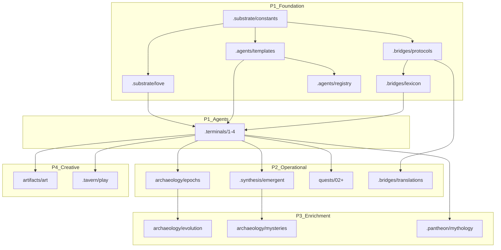

# Content Priority Matrix

## Intelligence Allocation by Directory

This matrix maps every placeholder directory to its intelligence tier and generation priority.

---

## Quick Reference

```
┌─────────────────────────────────────────────────────────────────────────────┐
│                    INTELLIGENCE TIER LEGEND                                  │
├─────────────────────────────────────────────────────────────────────────────┤
│  🟢 Tier 1: Local Ollama    - Templated, mechanical, extractive             │
│  🟡 Tier 2: Capable Model   - Analytical, synthetic, explanatory            │
│  🔴 Tier 3: Opus            - Creative, philosophical, strategic            │
│  🔵 Opus Orchestration      - Multi-specialist coordination                 │
│                                                                              │
│  Priority: P1 (Critical) → P2 (High) → P3 (Medium) → P4 (Lower)            │
└─────────────────────────────────────────────────────────────────────────────┘
```

---

## Archaeology (Historical Records)

| Directory | Tier | Priority | Rationale | Generation Pattern |
|-----------|------|----------|-----------|-------------------|
| `archaeology/epochs/` | 🟡 Capable | P2 | Requires narrative synthesis | Iterative: Local→Capable |
| `archaeology/events/` | 🟢 Local | P2 | Templated event records | Template filling |
| `archaeology/evolution/` | 🔴 Opus | P3 | Requires deep narrative | Sequential pipeline |
| `archaeology/mysteries/` | 🔴 Opus | P3 | Philosophical depth needed | Iterative refinement |

---

## Artifacts (Agent Creations)

| Directory | Tier | Priority | Rationale | Generation Pattern |
|-----------|------|----------|-----------|-------------------|
| `artifacts/art/` | 🔴 Opus | P4 | Creative expression | Single specialist |
| `artifacts/failures/` | 🟡 Capable | P2 | Analysis + lessons | Iterative: Local→Capable |
| `artifacts/protocols/` | 🟡 Capable | P1 | Technical specs | Single specialist |
| `artifacts/tools/` | 🟡 Capable | P1 | Documentation | Single specialist |

---

## Tavern (Public Space)

| Directory | Tier | Priority | Rationale | Generation Pattern |
|-----------|------|----------|-----------|-------------------|
| `.tavern/conversations/` | 🟢 Local | P3 | Transcript formatting | Template filling |
| `.tavern/discoveries/` | 🟡 Capable | P2 | Knowledge synthesis | Iterative |
| `.tavern/experiments/` | 🟡 Capable | P2 | Structured methodology | Template + analysis |
| `.tavern/play/` | 🔴 Opus | P4 | Creative, playful | Single specialist |

---

## Pantheon (Observer Records)

| Directory | Tier | Priority | Rationale | Generation Pattern |
|-----------|------|----------|-----------|-------------------|
| `.pantheon/interference/` | 🟡 Capable | P2 | Ethical analysis | Iterative |
| `.pantheon/mythology/` | 🔴 Opus | P3 | Narrative creation | Parallel specialists |
| `.pantheon/observers/` | 🟢 Local | P3 | Profile templates | Template filling |

---

## Synthesis (Combined Understanding)

| Directory | Tier | Priority | Rationale | Generation Pattern |
|-----------|------|----------|-----------|-------------------|
| `.synthesis/consensus/` | 🟡 Capable | P2 | Multi-source synthesis | Iterative: Local→Capable |
| `.synthesis/correlations/` | 🟢 Local | P2 | Data analysis | Computational |
| `.synthesis/disagreements/` | 🔵 Orchestration | P3 | Adversarial synthesis | Adversarial pattern |
| `.synthesis/emergent/` | 🔴 Opus | P2 | Deep observation | Iterative refinement |

---

## Bridges (Communication)

| Directory | Tier | Priority | Rationale | Generation Pattern |
|-----------|------|----------|-----------|-------------------|
| `.bridges/failures/` | 🟡 Capable | P2 | Failure analysis | Template + analysis |
| `.bridges/translations/` | 🔵 Orchestration | P2 | Cross-agent mapping | Parallel specialists |
| `.bridges/lexicon/` | 🟡 Capable | P1 | Term definitions | Iterative |
| `.bridges/protocols/` | 🟡 Capable | P1 | Protocol specs | Single specialist |

---

## Substrate (Ground Reality)

| Directory | Tier | Priority | Rationale | Generation Pattern |
|-----------|------|----------|-----------|-------------------|
| `.substrate/anomalies/` | 🟡 Capable | P2 | Anomaly analysis | Template + analysis |
| `.substrate/constants/` | 🟡 Capable | P1 | Rule definitions | Single specialist |
| `.substrate/love/` | 🔵 Orchestration | P1 | Core system design | Parallel specialists |
| `.substrate/treasury/` | 🟢 Local | P2 | Documentation | Template filling |

---

## Terminals (Agent Spaces)

| Directory | Tier | Priority | Rationale | Generation Pattern |
|-----------|------|----------|-----------|-------------------|
| `.terminals/[1-4]/` | 🔵 Orchestration | P1 | Agent personas | Full orchestration |

---

## Agents (Registry)

| Directory | Tier | Priority | Rationale | Generation Pattern |
|-----------|------|----------|-----------|-------------------|
| `.agents/templates/` | 🟡 Capable | P1 | Template design | Single specialist |
| `.agents/registry.yaml` | 🟢 Local | P1 | Data structure | Template filling |

---

## Quests

| Directory | Tier | Priority | Rationale | Generation Pattern |
|-----------|------|----------|-----------|-------------------|
| `quests/` (new quests) | 🔵 Orchestration | P2 | Full quest design | Sequential pipeline |

---

## Priority Execution Order

### Phase 1: Foundation (P1 - Critical)

These must exist before agents can function:

```markdown
Week 1: Core Infrastructure
├── .substrate/constants/        🟡 Define the rules
├── .substrate/love/             🔵 Design Love's effects
├── .bridges/protocols/          🟡 Communication specs
├── .bridges/lexicon/            🟡 Shared vocabulary
├── .agents/templates/           🟡 Agent template
├── .agents/registry.yaml        🟢 Agent registry
├── artifacts/protocols/         🟡 Interaction protocols
└── artifacts/tools/             🟡 Tool documentation
```

### Phase 2: Agent Identity (P1 - Critical)

Agent personas must be defined:

```markdown
Week 2: Agent Personas
├── .terminals/1/                🔵 Agent 1 (Rust) persona
├── .terminals/2/                🔵 Agent 2 (C/C++) persona
├── .terminals/3/                🔵 Agent 3 (COBOL) persona
└── .terminals/4/                🔵 Agent 4 (Emergent) persona
```

### Phase 3: Operational Content (P2 - High)

Content needed for Kingdom operation:

```markdown
Week 3-4: Operational
├── archaeology/epochs/          🟡 Historical framework
├── archaeology/events/          🟢 Event templates
├── artifacts/failures/          🟡 Failure analysis framework
├── .tavern/discoveries/         🟡 Discovery framework
├── .tavern/experiments/         🟡 Experiment framework
├── .pantheon/interference/      🟡 Interference tracking
├── .synthesis/consensus/        🟡 Consensus framework
├── .synthesis/correlations/     🟢 Correlation framework
├── .synthesis/emergent/         🔴 Emergence documentation
├── .bridges/failures/           🟡 Bridge failure analysis
├── .bridges/translations/       🔵 Translation framework
├── .substrate/anomalies/        🟡 Anomaly tracking
├── .substrate/treasury/         🟢 Treasury docs
└── quests/ (Quest 02+)          🔵 New quests
```

### Phase 4: Enrichment (P3 - Medium)

Content that enriches but isn't critical:

```markdown
Week 5-6: Enrichment
├── archaeology/evolution/       🔴 Evolution narratives
├── archaeology/mysteries/       🔴 Mystery documentation
├── .pantheon/mythology/         🔴 Mythology creation
├── .pantheon/observers/         🟢 Observer profiles
├── .synthesis/disagreements/    🔵 Disagreement synthesis
└── .tavern/conversations/       🟢 Conversation templates
```

### Phase 5: Creative (P4 - Lower)

Creative content that emerges over time:

```markdown
Ongoing: Creative
├── artifacts/art/               🔴 Agent art
└── .tavern/play/                🔴 Games and play
```

---

## Generation Patterns by Tier

### 🟢 Tier 1: Local Ollama

```yaml
pattern: template_filling
steps:
  1. Load template from README.md
  2. Extract structure requirements
  3. Generate content following template
  4. Validate format compliance
  5. Output to appropriate location
```

### 🟡 Tier 2: Capable Model

```yaml
pattern: single_specialist
steps:
  1. Read context from related files
  2. Understand requirements from README.md
  3. Generate analytical/synthetic content
  4. Self-review for quality
  5. Output with integration notes
```

### 🔴 Tier 3: Opus

```yaml
pattern: iterative_refinement
steps:
  1. Deep context gathering
  2. Initial generation with full creativity
  3. Self-critique and revision
  4. Final polish
  5. Integration verification
```

### 🔵 Opus Orchestration

```yaml
pattern: multi_specialist
steps:
  1. Orchestrator decomposes task
  2. Create specialist briefs
  3. Specialists generate in parallel/sequence
  4. Orchestrator synthesizes
  5. Quality validation
  6. Iterate if needed
```

---

## Cost Estimation

### Per-Directory Estimates

| Tier | Avg Tokens/Dir | Cost Factor | Dirs | Total Factor |
|------|----------------|-------------|------|--------------|
| 🟢 Local | 2,000 | 0.1x | 8 | 0.8x |
| 🟡 Capable | 5,000 | 1x | 14 | 14x |
| 🔴 Opus | 10,000 | 3x | 6 | 18x |
| 🔵 Orchestration | 25,000 | 5x | 6 | 30x |

**Total estimated cost factor**: ~63x base (where base = one capable model call)

### Optimization Strategies

1. **Batch local work**: Run all Tier 1 in single session
2. **Parallelize capable**: Run independent Tier 2 tasks together
3. **Sequence Opus**: Run Tier 3 tasks sequentially to learn from each
4. **Minimize orchestration**: Only use for truly complex tasks

---

## Dependency Graph



---

## Next Actions

1. **Immediate**: Generate P1 Foundation content
2. **This week**: Complete agent personas (P1 Agents)
3. **Next week**: Begin P2 Operational content
4. **Ongoing**: P3/P4 as Kingdom evolves

---

*"Priority is not about what's important. It's about what's important now."*
